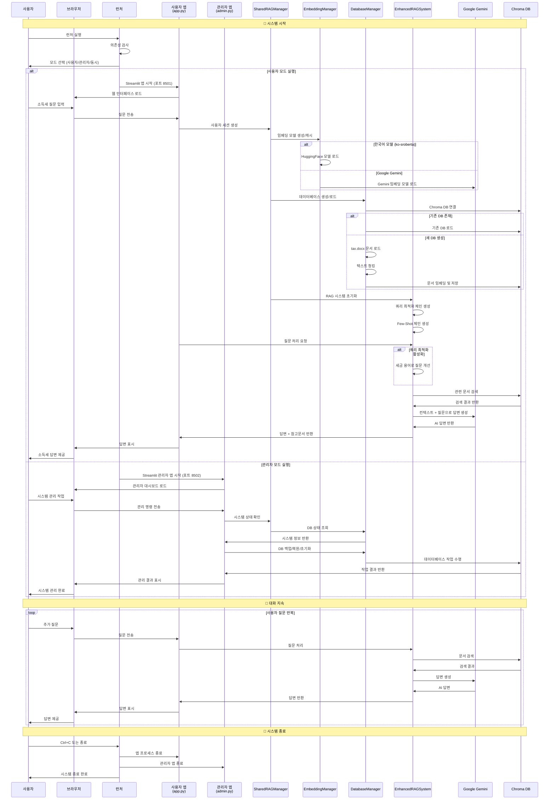

# 소득세 챗봇 프로젝트 호출 흐름

## 시스템 아키텍처

이 프로젝트는 Streamlit 기반의 RAG(Retrieval-Augmented Generation) 시스템으로, 사용자와 관리자 모드를 분리하여 운영됩니다.

## 호출 흐름 다이어그램



## 주요 구성 요소

### 1. 런처 시스템

- **launcher.py**: 통합 런처 (사용자/관리자 모드 선택)
- **run.py**: 사용자 모드 전용 실행 스크립트
- **run_admin.py**: 관리자 모드 전용 실행 스크립트

### 2. 사용자 인터페이스

- **app.py**: 메인 챗봇 인터페이스 (포트 8501)
- 소득세 질문 입력 및 AI 답변 제공
- 자동 시스템 초기화 및 API 키 관리

### 3. 관리자 인터페이스

- **admin.py**: 시스템 관리 대시보드 (포트 8502)
- 데이터베이스 상태 모니터링
- 백업/복원/초기화 기능

### 4. RAG 엔진 (retrieval/)

- **shared_rag_manager.py**: 싱글톤 패턴의 공유 리소스 관리
- **enhanced_rag.py**: 향상된 RAG 시스템 (쿼리 최적화, Few-Shot)
- **embedding_manager.py**: 임베딩 모델 관리 (한국어/Gemini)
- **database_manager.py**: Chroma 벡터 DB 관리
- **conversation_history.py**: 대화 기록 관리

## 시스템 특징

1. **이중 포트 구조**: 사용자(8501)와 관리자(8502) 모드 분리
2. **싱글톤 패턴**: 리소스 공유 및 캐싱으로 성능 최적화
3. **모듈화된 RAG**: 쿼리 최적화 및 Few-Shot 학습 지원
4. **하이브리드 임베딩**: 한국어 특화 모델과 Google Gemini 모델
5. **자동 초기화**: API 키 입력 시 자동으로 시스템 구성
6. **대화 기록 관리**: Streamlit 세션 상태로 대화 이력 유지

## 실행 방법

```bash
# 통합 런처 (대화형 모드)
python launcher.py

# 사용자 모드만 실행
python launcher.py user

# 관리자 모드만 실행
python launcher.py admin

# 두 모드 동시 실행
python launcher.py both
```
